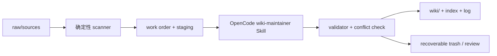

# 架构说明

## 核心判断

“全自动维护”不能完全交给 LLM。LLM 适合判断语义、合并知识和重写页面，不适合独立负责文件身份、删除范围、事务和恢复。项目因此采用双层内核：

构建侧（`wiki_maintainer/`）负责这条生命周期链；检索侧（`wiki_retrieval/`）是独立的查询层，构建成功提交后按需重建向量索引，二者在编译期解耦（详见「检索侧」一节）。

## baseline 的取舍

保留：

- Karpathy 三层模型：Raw Sources → Compiled Wiki → Schema。
- nashsu 的 hash 增量、两阶段理解/生成、source watcher 和 crash recovery 思路。
- green-dalii 的纯 Markdown、Obsidian 原生 wikilink、低基础设施依赖。

不复制：

- Tauri/React 桌面壳、Obsidian 插件 API、内嵌模型设置 UI。
- 以页面全文模糊匹配 source 文件名的删除判断。
- 让模型直接覆盖 `index.md`、`log.md` 或 active wiki。
- 把向量数据库当作生命周期正确性的前提；它只是查询优化，构建事务不依赖它。

## 数据模型

`.wiki-state/manifest.json` 是系统事实表。

- source：稳定 UUID、规范化相对路径、SHA-256、状态、贡献页面。
- page：相对路径、精确 `source_ids`、最后提交内容 hash。
- batch：当前工作单、事件、受影响页面的 base hash、暂存区和结果。

页面 frontmatter 同时保留 `source_ids` 和 `sources`：前者用于机器身份和重命名，后者用于人类可读溯源。

## 增删改状态机

| 事件 | 身份 | 语义动作 | 提交动作 |
|---|---|---|---|
| new | 新 UUID | 创建或合并知识 | upsert staging pages |
| modified | 保持 UUID | 替换过时信息 | 校验所有受影响页 |
| moved | hash 唯一匹配后保持 UUID | 更新精确路径 | 不创建重复来源 |
| restored | 复用 tombstone UUID | 与当前 wiki 重新合并 | source 回到 active |
| deleted | tombstone 保留 | 共享页按幸存 source 重写 | 独占页移入 trash |

重命名只有在“一个丢失文件与一个新增文件的 hash 唯一相同”时自动判定；有歧义时按删除+新增处理，避免错误合并身份。

## 事务与冲突

`prepare` 复制受影响页面到 batch staging 并记录 active hash。OpenCode 只改 staging。`commit` 验证：

1. staged page 只能在 wiki 相对路径内；
2. 必须 `wiki_managed: true`；
3. `source_ids` 必须全部处于未来 active 集合；
4. `sources` 必须和这些 ID 的规范路径精确对应；
5. modified/deleted source 的共享页必须被语义重写；
6. active 页面 hash 必须仍等于 prepare 时的 base hash。

验证全部通过后才发布，并重建 manifest/index/log。发布前会备份所有目标页与 manifest，并写 commit journal；异常或下次重试会恢复中断的发布。独占孤儿页移动到可恢复 trash，不做永久删除。

## 检索侧

检索侧是 `wiki_retrieval/` 独立包，通过 MCP 暴露三个工具：`retrieve`（向量 + 关键词 + 图三通道，RRF 融合，`scope` 可选 wiki/source/both）、`graph_neighbors`（页面一跳邻接）、`knowledge_tree`（确定性目录）。向量通道用 LanceDB 落盘、embedding 服务向量化；无 embedding key 时该通道降级缺席，关键词与图通道照常返回，绝不因缺 key 而失败。索引是派生物：`commit` 成功后惰性触发重建，失败不回滚提交，靠 `stale_index` 标记与下次提交自愈。构建侧对检索侧只做 lazy import，编译期零耦合。

## 已知边界

- MVP watcher 使用轮询；大量文件时应替换为 OS 原生事件并保留周期性全量 rescan 兜底。
- 同内容的多文件同时移动时无法可靠判断一一对应，系统会保守地按新增/删除处理。
- PDF 复杂版式、OCR、音视频需要可插拔 extractor；生命周期协议无需随 extractor 改变。抽取环节由解析组（`parsing/`）负责，构建引擎只读取抽取产出的 md。
- 跨 source 的句级 claim lineage 已支持 page↔source↔chunk 粒度的 `wiki-claim` 标记；更细的自动句级归属仍待完善。
